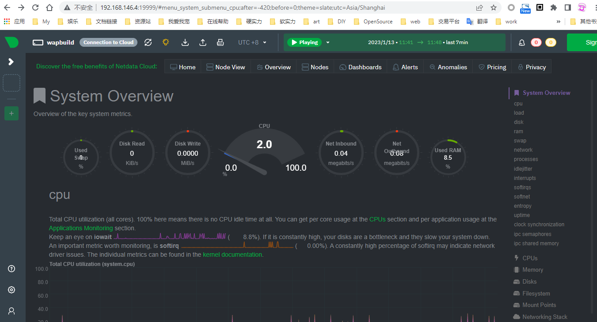
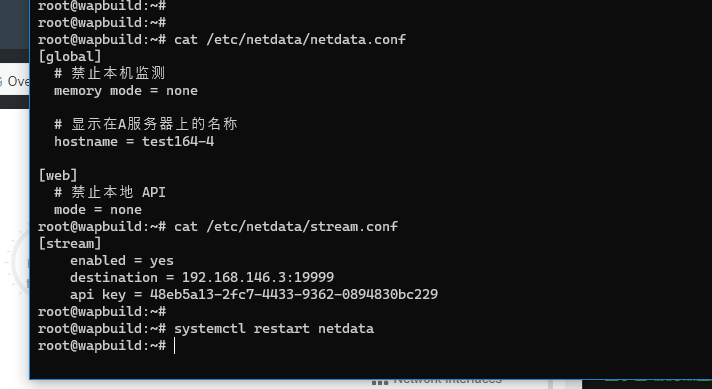
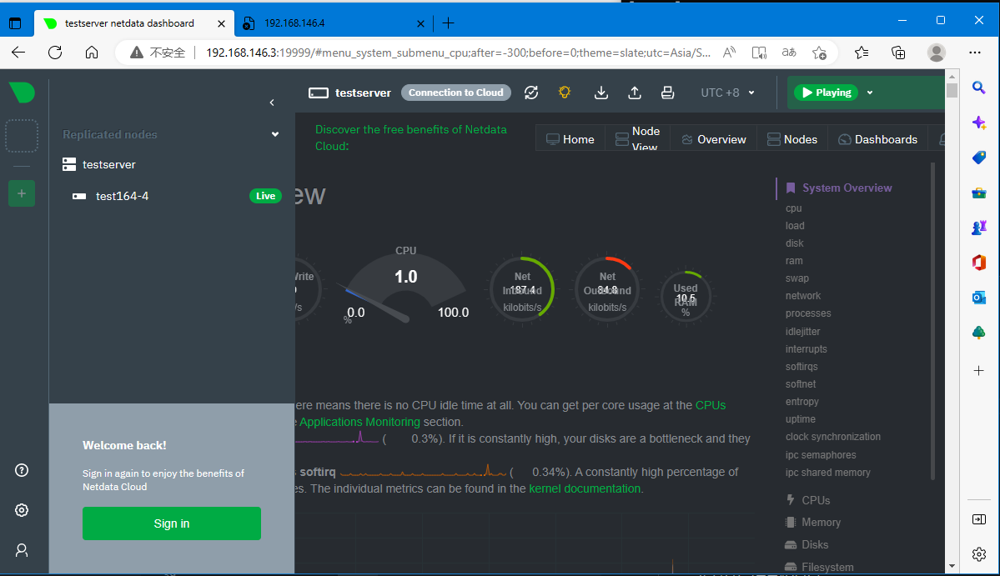

# 系统监控服务NetData部署 


> **官网：** https://learn.netdata.cloud/docs/get-started  
> **环境：** Debian GNU/Linux 11 (VirtualBox)  x 2台  
> **IP:** 
>  - A 192.168.146.3  -- 主节点  
>  - B 192.168.146.4  -- 从节点  
> 
> **端口：** 19999 (netdata默认端口)


## install

直接使用官网的安装命令进行安装

```
wget -O /tmp/netdata-kickstart.sh https://my-netdata.io/kickstart.sh && sh /tmp/netdata-kickstart.sh
```

### 启动

安装完成后打开 http://192.168.146.4:19999/




### 常用命令


显示服务状态

```sh
systemctl status netdata
```

启动服务
```sh
sudo systemctl start netdata
sudo systemctl restart netdata   // 重启
```

关闭服务
```sh
sudo systemctl stop netdata
```


## 集群配置

> **服务器节点:** 
>  - A 192.168.146.3  -- 主节点  
>  - B 192.168.146.4  -- 从节点  

A 服务器作为主服务，B作为从服务。 B服务器的数据发送到A主服务节点。


### B 192.168.146.4 从服务配置

修改节点配置，关闭本地监控关闭监听

```sh
vim /etc/netdata/netdata.conf
```

```toml
[global]
  # 禁止本机监测
  memory mode = none

  # 显示在A服务器上的名称
  hostname = test164-4

[web]
  # 禁止本地 API
  mode = none
```

增加配置`stream.conf` 把监控数据传输给A服务器。stream.conf 文件在 `/etc/netdata` 中`netdata.conf` 同目录

```sh
vim /etc/netdata/stream.conf
```

```toml
[stream]
  # 把指标数据发送到另外一台A服务节点
  enabled = yes

  # 指向主服务器的IP和端口  
  destination = 192.168.146.3:19999

  # 当前B节点的API key，可以用uuidgen工具生成
  api key = 48eb5a13-2fc7-4433-9362-0894830bc229
```

> 注：api key 是个UUID，找个工具生成一个`11111111-2222-3333-4444-555555555555`格式ID

B节点配置完成并重启，http://192.168.146.4:19999/ 就不再显示监控信息。




### 配置 A 192.168.146.3 主监控服务器

监控信息需要从B节点服务获取信息。

同样配置 `netdata.conf` 和 增加 `stream.conf` 

1. 在A主服务上增加个服务器组名称，在 `global` 分组中增加一行内容 `hostname = testserver`

```sh
vi /etc/netdata/netdata.conf
```

```toml
[global]
    hostname = testserver
    ...
...
```

2. 增加 stream.conf， 文件在 `netdata.conf` 同目录


```sh
vim /etc/netdata/stream.conf
```

关联并接收B服务器的指标数据。如果有多个的话，在stream.conf中增加其他的节点API key。

```toml
[48eb5a13-2fc7-4433-9362-0894830bc229]
    # 允许接收这个API key（B节点）数据
    enabled = yes
    # 显示一小时的历史数据
    default history = 3600
    # 数据不保存到硬盘
    default memory = ram
    # 节点连接时显示警告信息
    health enabled by default = auto
    allow from = *
```

同样配置完成重启服务

```sh
systemctl restart netdata
```

配置完成后可以看到B（test164-4）节点信息。




## 生成UUID

配置文件需要生成一个`uuid`，可以使用`uuidgen`命令生成

```bash
sudo apt-get install uuid-runtime

$ uuidgen
3171037f-98a3-4984-a399-2bfce642b57c
```
