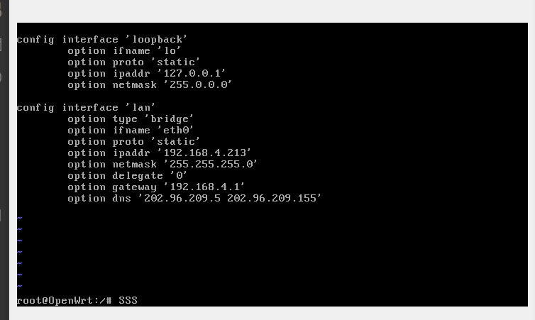
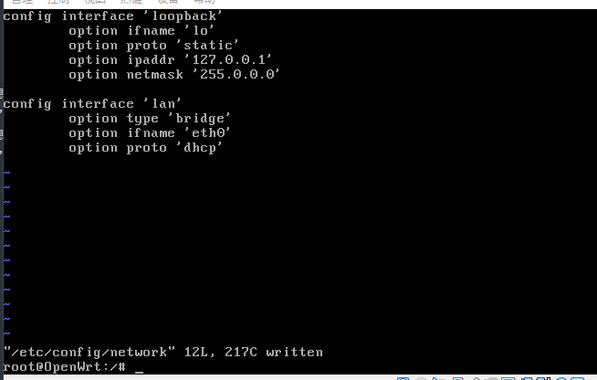

# openwrt

网络设置




SSID:	fumasoft-dev
协议:	Wi-Fi 4 (802.11n)
安全类型:	开放
网络频带:	2.4 GHz
网络通道:	6
链接速度(接收/传输):	72/72 (Mbps)
本地链接 IPv6 地址:	fe80::b147:b5f4:7ac5:b948%12
IPv4 地址:	192.168.8.151
IPv4 DNS 服务器:	202.96.209.5
202.96.209.133
制造商:	Intel Corporation
描述:	Intel(R) Dual Band Wireless-AC 3165
驱动程序版本:	19.51.30.1
物理地址(MAC):	74-E5-F9-70-3D-B1

## 通过 uci 批量修改网卡

如修改下面 eth2 网卡为动态获取

```shell
uci batch <<EOF
set network.lan=interface
set network.lan.ifname='eth2'
set network.lan.proto='dhcp'
EOF
uci commit
```

直接修改配置

```
vim /etc/config/network
```
